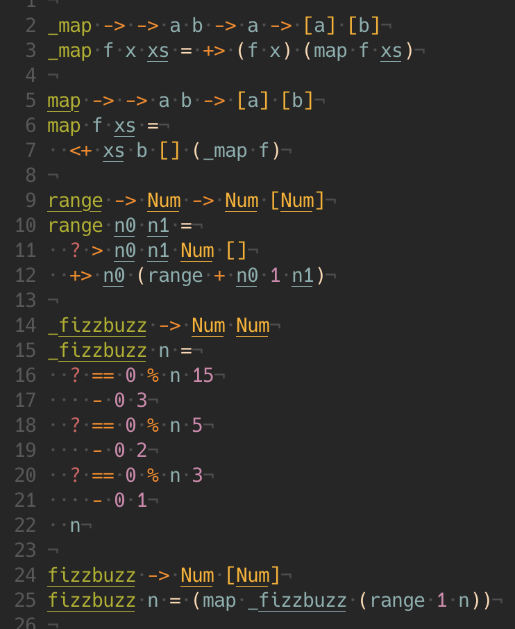

<p align="center">
	
</p>

<p align="center">
	<h1 align="center">Portcullis</h1>
  <h4 align="center">A minimalist / functional / dataflow programming language.</h4>
</p>

fib.po


compiles to fib.js

```js
// signature: (Num -> Num)
export function fib(n) {
  return (
    _lte_(n)(1.0) ? 1.0 : _plus_(fib(_minus_(n)(1.0)))(fib(_minus_(n)(2.0)))
  );
}
```

compiles to fib.py

```py
# signature: (Num -> Num)
def fib(n):
  return (1.0 if _lte_(n)(1.0) else _plus_(fib(_minus_(n)(1.0)))(fib(_minus_(n)(2.0))))
```

compiles to fib.lua

```lua
-- signature: (Num -> Num)
function fib(n)
  return (_lte_(n)(1.0) > 0 and 1.0 or _plus_(fib(_minus_(n)(1.0)))(fib(_minus_(n)(2.0))))
end
```

<hr>

fizzbuzz.po



```
Deno 1.22.0
exit using ctrl+d or close()
> fizzbuzz(20)
[
   1,  2, -1,  4, -2, -1,  7,
   8, -1, -2, 11, -1, 13, 14,
  -3, 16, 17, -1, 19, -2
]
```

## About

I wrote the compiler for Portcullis purely for my own education and amusement. Painfully specific goals guided the development of this project and account for both the language features I chose to include as well as omit.

Some of these goals include
- minimalism
- [purity](https://en.wikipedia.org/wiki/Purely_functional_programming)
- [parametric polymorphism](https://en.wikipedia.org/wiki/Parametric_polymorphism)

## More
- [Introduction](./docs/About.md)
- [Language Guide](./docs/Docs.md)
- [Developer Guide](./docs/Dev.md)
- [Vim Syntax Highlighting](https://github.com/jzwood/portcullis-vim)
