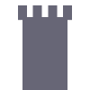
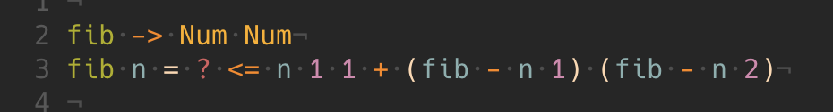

<p align="center">
	
</p>

<p align="center">
	<h1 align="center">Portcullis</h1>
  <h4 align="center">A simple programming language.</h4>
</p>


fib.po

 Num Num
fib n =
  ?  <= n 1 1
  ?? + (fib - n 1) (fib - n 2)">

compiles to fib.js

```js
// function "fib" has type (Num -> Num)
function fib(n) {
	return (() => {
		if ((n<=1.0)) {
			return 1.0;
		}
		return (fib((n-1.0))+fib((n-2.0)));
	})();
}
```

### more
- [Language Guide](Docs.md)
- [User Guide](UserGuide.md)
- [Developer Guide](LocalDev.md)
- [Vim Syntax Highlighting](https://github.com/jzwood/portcullis-vim)
